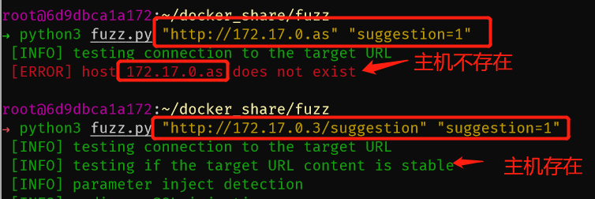
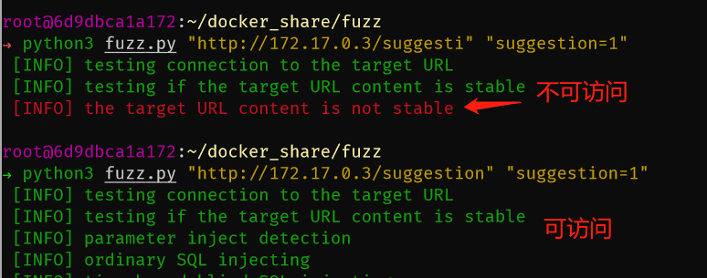
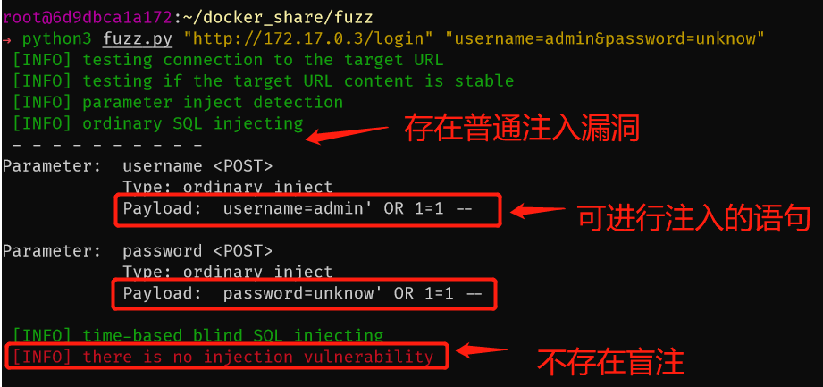
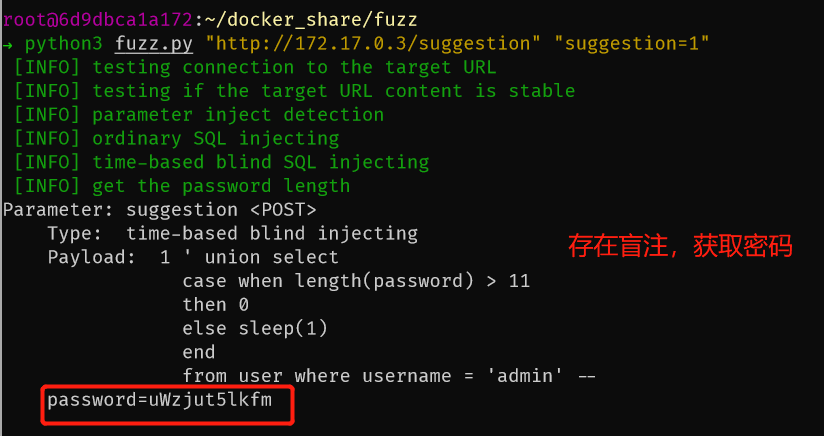

# sql注入检测工具

----------

## 开发环境
* `Ubuntu 18.04`
* `python 3.6.8`

----------

## 依赖包
* `requests`
* `urllib`
* `sys`
* `hashlib`
* `time`
* `math`

## 功能说明
* 对静态网页进行SQL注入检测,网页提交方式为POST方法

## 使用方法
`python fuzz.py <url> <form_data=data>`

## 主要函数介绍

```
# 测试目标主机是否存活
def host_status(url)

# 测试目标URL是否稳定(即是否是静态网页以及是否能正常访问)
# 先测试是否能正常访问，若可以，则在较短时间内访问两次，并保存页面的md5值，比较前后两次得到的md5是否相等
def page_status(url)

# 尝试进行普通SQL注入，使用'or num==num和 ' or num==num+1语句测试，计算两种语句返回网页的md5，比较是否相似，若不同则可能存在sql注入，继续下一步操作
def or_inject(url, params)

# 若普通注入失败，采用SQL盲注的方法
# 采用SQL时间盲注，主要用到二分查找算法
def time_base_inject(url, params)
```
## 测试用例
* 基于python编写的简单web应用，存在普通类型的SQL注入漏洞和SQL盲注漏洞

## 扫描过程
* 测试目标主机是否存活
	* 
* 测试目标网页是否稳定(可访问且是静态网页)
	* 
* 测试URL是否可注入
	* 普通注入检测
	* 
	* SQL时间盲注检测（此处payload中的11即为获取到的password长度）
	* 
