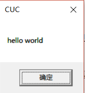
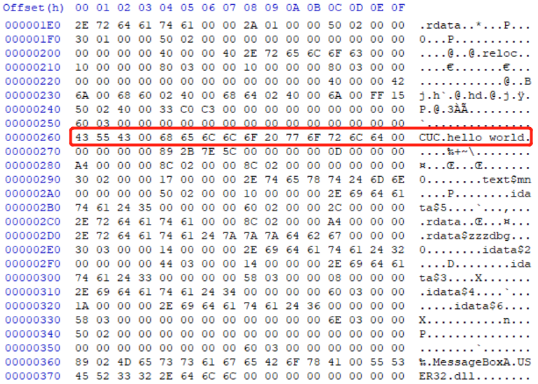
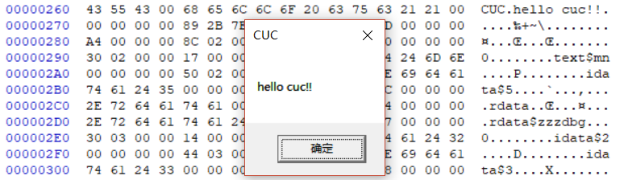
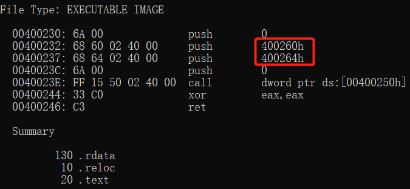
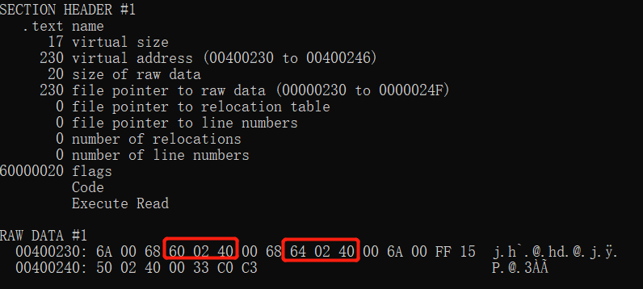
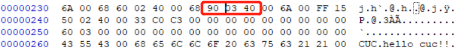
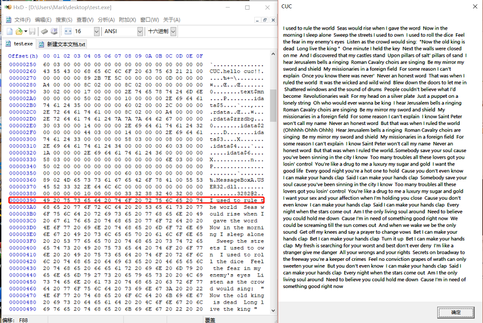

# 实验报告一
## 实验要求
* 编写一个release版本的 hello world 程序。通过修改程序可执行文件的方式（不是修改源代码），使得程序运行后显示的内容不为hello world，变成 hello cuc！ 
* 上一题的程序中，修改的显示内容变为一个很长的字符串（至少2kb长）。并且保证程序正常运行不崩溃。
## 实验过程
* 使用VS2017的x64_x86交叉工具命令提示符对编写的c代码进行编译链接
* <pre>
	#include <windows.h>
	int main() {
		MessageBoxA(NULL,"hello world","CUC", NULL);
	}
	</pre>
* 不做修改时运行`test.exe`效果如下
	* 
* 此时文件大小为912字节
	* 
* 使用`hex editor`查看`test.exe`，可以发现`MessageBoxA`用到的四个参数，如图
	* 
* 将`hello world`改为`hello cuc!!`保存后再次运行`test.exe`效果如下
	* 
* 使用dumpbin指令查看文件的反汇编，可以发现`400260h`和`400264h`即为`CUC`和`hello cuc!!`这两个参数在内存中的优先存储地址。
	* 
* 使用dumpbin指令查看文件的所有信息，在.text字段找到了上述两个地址。可知程序在运行时是从这两个指针指向的位置取出参数并打印出来，修改指针指向的位置即可得到不同的打印结果。
	* 
* .text字段在文件中的地址是230h，使用`hex editor`查看`test.exe`，找到该地址，将`400264h`修改为`400390h`,及此处原本指向`hello cuc!!`所在的位置，现在改为指向文件末尾地址，然后在文件末尾添加至少2KB字符，保存后再次运行`test.exe`。
	* 
* 效果如图，此时文件大小为3.88KB。
	* 
	* 