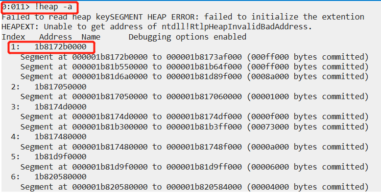
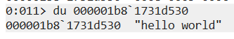
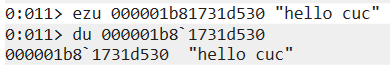

# 实验三

----------

## 实验要求
* 在notepad（32位64位均可）中，输入一段文字。然后使用调试器，在内存中修改这段文字。使得没有在界面操作notepad的修改文字的情况下。notepad中显示的文字变化。
## 实验过程
* 新建.txt文件，输入文字"hello world"
	* 
* 在未关闭.txt文件的前提下，打开`windbg`→`文件`→`Attach to process`→`notepad.exe`
* 使用`!heap -a`指令查看notepad已分配的堆的信息,结果如下，已使用n个堆
	* 
* s指令可以查找内存搜索指定内容，首先从第一个堆开始搜索，指令`s -u 1b8172b0000 Lff000 "hello world"`,得到如下结果，即搜索成功
	* 
* 使用`du 000001b81731d530`显示指定地址的Unicode
	* 
* 使用`ezu 000001b81731d530 "hello cuc" `向指定内存写入NULL结尾的Unicode字符串,使用`du 000001b81731d530`查看修改结果，修改成功.
	* 
* 使用`g`程序继续运行，查看notepad，修改成功
	* 